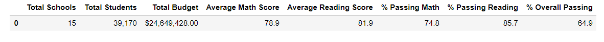
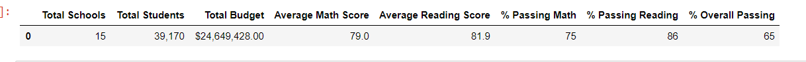
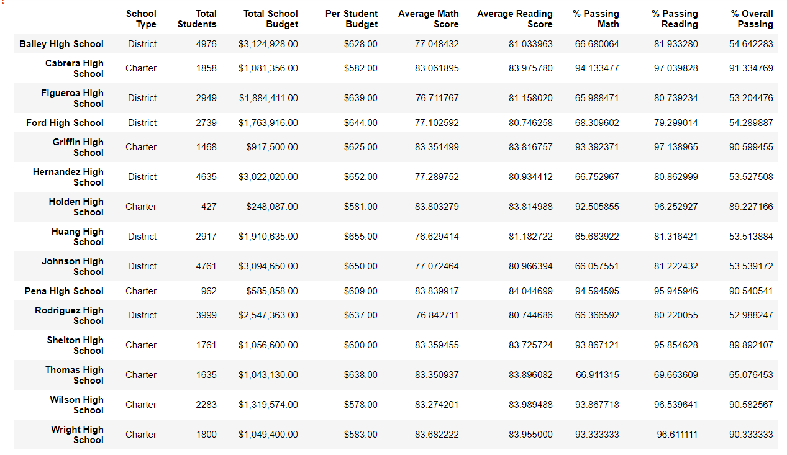
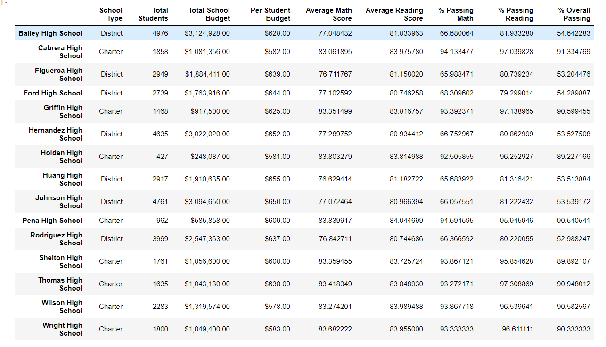

# School_District_Analysis
## Overview
Maria has been asked to conduct an analysis of the the testing results of a group of schools for the school district. Using the data provided, we helped her look at how various frameworks affect school testing scores from the type of school, size of school, grades, funding, and individual schools. Using these segments, we were then able to look at the math, reading, and overall scores in the data. After submitting our analysis to the scoreboard, they came back and asked us to do the analysis again without Thomas High School's ninth grade because of evidence of academic dishonest.
## Results
 
District Summary
- In the district summary, there were small difference as evidence in the pictures above but the results mostly stayed the same. The differences would mostly round to being the same numbers. 
- The new district summary is first and the old one is second for reference.
School Summary
 
- The only differences in this dataframe would be on Thomas High School because that is the only school where we altered the data.
- While the average scores similar as in the district analysis, there is a large decrease in the amount of kids that passed. This is because all of the students in the 9th grade are considered as having failed due to the fact that their data is not included. The numbers changed from above 90% passing to between 65 and 70%.
- The new district summary is first and the old one is second for reference.
Thomas High School Relative Performance
- The alterations in this data drastically changed Thomas High School's performance. They went from being one of the best performing high schools to the one of the worst. While there are some ditrict schoolst that are still performing poorly, they are the worst of the chartered schools.
Effects on other metrics
- The difference between the math and reading scores by grade was very small. It brought both 9th grade scores down by less than 1%.
- When looking at the difference based on school spending, we found that the data did not change when taking into account rounding, the results stayed the same.
- Similar to the breakout by school spending, there was no noticaeable difference in the performance based on school size. 
- Lastly, looking at the summary by school type, removing Thomas High School's 9th grade did not drastically alter the data enough to make a difference after rounding.
## Summary
In summary, the alterations to Thomas High School's ninth grade data did not signifcantly change the outcome of the results. The four biggest changes were:
1. The average math score for all schools dropped by .1 points.
2. Thomas High School dropped out of the top performing schools.
3. Thomas High School's overall passing dropped from 91% to 65%.
4. The overall 9th grade math and reading scores dropped by a few points.

While removing Thomas High School's data was important for data integrity, it did not signifcantly change any of the results overall. We could see slight changes in the data but there were a few decimal places over and so minor that a change was not seen when rounding. 
